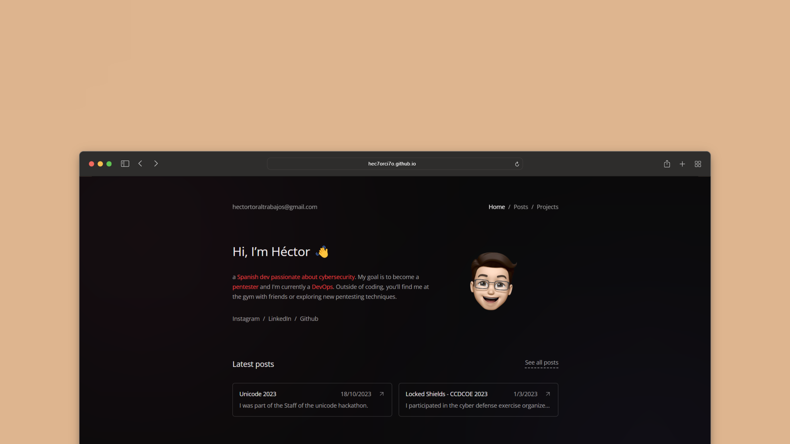

# 👨‍🚀 Astro - Portfolio

This theme/template was designed and crafted by [maxencewolff](https://www.maxencewolff.com).
NB: Additional color themes can also be configured on the `src/data/theme.ts` file.

## 🥷 Usage

- You can modify all the information in the files in the `data` folder (presentation, social links, projects list, colors).
- You can write articles in `markdown` format in the `content/posts` folder.

## 🧞 Commands

All commands are run from the root of the project, from a terminal:

| Command                   | Action                                           |
| :------------------------ | :----------------------------------------------- |
| `npm install`             | Installs dependencies                            |
| `npm run dev`             | Starts local dev server at `localhost:4321`      |
| `npm run build`           | Build your production site to `./dist/`          |
| `npm run preview`         | Preview your build locally, before deploying     |
| `npm run astro ...`       | Run CLI commands like `astro add`, `astro check` |
| `npm run astro -- --help` | Get help using the Astro CLI                     |