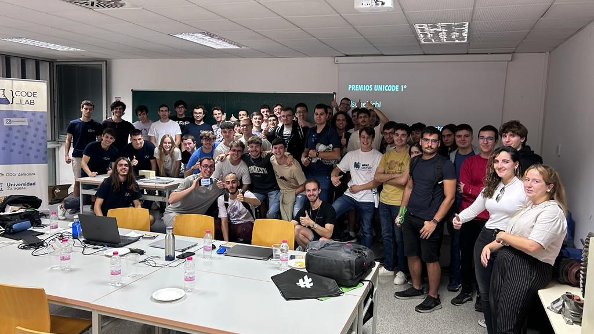

## ¿Qué es Unicode?

Unicode marca el inicio de la primera hackathon de [codelab], un evento de corta duración en el que los participantes, organizados en grupos de 2 a 4 personas, abordarón una serie de desafíos previamente planteados por nosotros. Este emocionante encuentro tuvo lugar en el edificio Betancourt de la Escuela de Ingeniería y Arquitectura el 18 de octubre de 2023.

Para muchos estudiantes, Unicode representó su primer acercamiento al mundo de los hackatones. A pesar de que la mayoría de los participantes eran estudiantes de primer año, también se contó con la presencia de estudiantes de segundo, tercer, cuarto año e incluso algunos estudiantes de posgrado. El evento fue un rotundo éxito y se espera con entusiasmo la posibilidad de organizar eventos similares en el futuro.

## 🤯 Enunciados a resolver

### Más estudiantes

El primer desafío consistía en organizar una excursión para la Escuela de Ingeniería y Arquitectura ([EINA]). La meta primordial era estructurar la excursión considerando el número de estudiantes de cada una de las clases, así como respetando el límite máximo de participantes permitido. El objetivo clave era seleccionar qué clases participarían en la excursión de manera que, se maximizara la cantidad de estudiantes presentes, sin exceder la capacidad máxima establecida para el evento.

### Mejor ruta

Siguiendo con la misma temática, el objetivo de este segundo reto era identificar la ruta más corta para llevar a cabo la excursión desde la [EINA] hasta Ingenieros Libres SL en Badajoz. Para abordar esta tarea, les suministramos una lista de ciudades con las distancias estimadas desde cada una hasta la ciudad de destino. Además, se proporcionaron detalles sobre las carreteras que conectan cada ciudad, incluyendo la longitud de cada tramo kilométrico.

## 🏆 Premios 

Con el fin de recompensar el esfuerzo de los participantes, otorgamos algunos premios a los equipos que lograron resolver los desafíos planteados. Los premios que otorgamos a los equipos vencedores variaban en función del puesto en el que habían quedado, siendo camisetas para los primeros, cantimploras para los segundos y una libreta para los terceros.

## 👻 Staff 

El evento fue organizado por el equipo de [codelab] y contó con la colaboración de los siguientes miembros:
[Jorge Aranda](https://www.linkedin.com/in/jorge-aranda-sanz-b64874226/),
[Lucas Cauhé](https://www.linkedin.com/in/lucas-cauh%C3%A9-vi%C3%B1ao-b103b51a4/),
[Darío Marcos](https://www.linkedin.com/in/dar%C3%ADo-marcos-casal%C3%A9-3b9551246/),
[Francisco Javier Pizarro](https://www.linkedin.com/in/franciscopizarrojavier/),
[Héctor Toral](https://www.linkedin.com/in/hec7or/)

[codelab]: https://codelabzgz.github.io/
